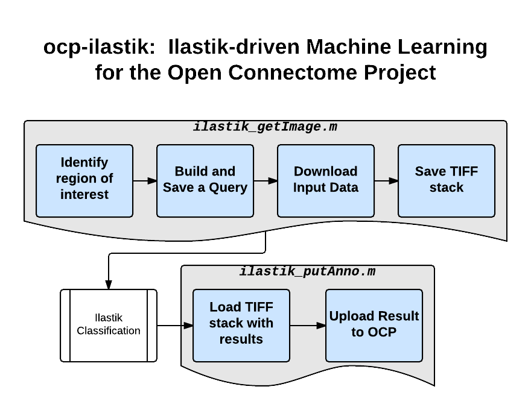

ilastik
***********

ilastik is a tool developed to do machine annotation and is widely used by the connectomics community.  Here, we developed a lightweight protocol and data exchange format to allow users to use ilastik and OCP together.  This provides an easy method for users to quickly prototype, build, and deploy machine learning solutions to neuroscience problems.  The figure below outlines a sample workflow.  The initial version of this workflow only supports pixel classification.

Train
-----

- Identify a region of interest in OCP, and note the data server, token, resolution, and coordinates
- Create a query, using the instructions for CAJAL
- Run *ilastik_getImage.m* to generate an image volume suitable for annotation in ilastik
- Using ilastik, build a pixel classifier, following the `Pixel Classification instructions in Ilastik <http://ilastik.org/documentation/pixelclassification/pixelclassification.html>`_
- Save your ilastik project, containing your trained classifier

Deploy
------

- Identify a region of interest in OCP, and note the data server, token, resolution, and coordinates
- Create a query, using the instructions for CAJAL
- Run *ilastik_getImage.m* to generate an image volume suitable for annotation in ilastik.  This can be batched using our LONI framework tools
- Classify the volume of interest using `Ilastik in headless mode <http://ilastik.org/documentation/pixelclassification/headless.html>`_.

**Choose from one of the following options to post-process and upload your data**

- Upload raw probabilities:  *put_anno_probs.m*, specifying the server, token, annotation file, and query used to download the underlying image. This uploads a probability map of your annotations to the server

- Convert into objects and upload as a volume.  (We recommend thresholding, grouping objects by connected components, and size filtering, but this is outside the scope of a basic tutorial.)  If objects are created, they can be uploaded using:  ocp_upload_dense.m (see CAJAL documentation).

Example
-------

- *"I want to add annotations to my dataset."*
^^^^^^^^^^^^^^^^^^^^^^^^^^^^^^^^^^^^^^^^^^^^

    1. **Pick a region of interest in OCP.** We'll use the ``kasthuri11`` dataset, and query a RAMON Volume as described in the `CAJAL documentation <http://w.ocp.me/faq:download>`_. ::

        oo = OCP();
        oo.setServerLocation('http://openconnecto.me/');
        oo.setImageToken('kasthuri11');
        oo.setDefaultResolution(1);

        q = OCPQuery(eOCPQueryType.imageDense);

        xstart = 16000;  xstop = 17000;
        ystart = 15000;  ystop = 16000;
        zstart = 3900;   zstop = 3910;
        resolution = 1;

        q.setCutoutArgs([xstart xstop],...
                        [ystart ystop],...
                        [zstart zstop],...
                        1);

      At this point, you can verify that you have a valid query with the following line::

        [pf, msg] = q.validate()

    2. With our query successfully built, we'll download the data and store it in ``im``::

        im = oo.query(q);

      You can confirm that you have successfully downloaded the data with the visualizer, ``image(im);``.

    3. This site has a demo pixel classifier file that has been (poorly) trained for synapses in this dataset. It can be downloaded `here </_static/example_kas11_classifier.ilp>`_. We'll use it to derive annotations for the entire dataset using **macho**.

    4. Run `ilastik_runIlastik.m`. This function takes three arguments: ``ilastikProjectPath``, ``stackName``, ``outputPath``. They are documented inline. For our purposes, we can run::

        ilastik_runIlastik('./example_kas11_classifier.ilp', 'kas11cc.tiff', './results/')

    5. If all went well, you should be left with a file called ``/tmp`` inside of which is a tiff-stack output of annotations.

    6. Last, we'll upload these annotations back to OCP, using the ``ilastik_put_anno`` function.

    7. **Uploading annotations from Ilastik**: Use the ``ilastik_put_anno`` function to upload your annotations. 

- Example File
^^^^^^^^^^^^^^

    Check out the file ``run_ilastik_example.m`` for a complete standalone example.

Advanced Topics/Future Functionality
------------------------------------

- When uploading annotations processed as many small cubes, often some sort of padding or stitching operation is required.  These will differ slightly depending on use cases.  Examples exist (e.g., i2g, vesicle) to use as a starting point

- ilastik also supports object detection classifiers and manual labeling.  Our wrappers should work unchanged.  The only changes expected are with the users' ilastik application.  Please let us know if you would like us to develop these protocols.
